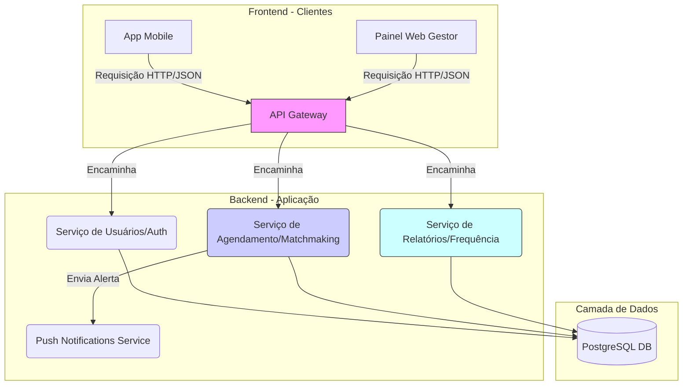

# Arquitetura do Sistema – Plataforma Conecta Saber 🧑‍🎓

## 1\. Visão Geral da Arquitetura

A arquitetura da plataforma **Conecta Saber** é baseada no modelo **Microsserviços/Camadas Desacopladas**. Foi projetada para ser **multiplataforma**, **escalável** e **segura**, dividida em componentes que facilitam a gestão de múltiplos perfis de usuários (Aluno, Voluntário, Gestor).

O sistema é composto por três camadas principais:

  * **Camada de Clientes (Frontend):** Responsável pela interface do usuário. Inclui o aplicativo mobile para Alunos/Voluntários e o Painel Web para Gestores/Professores.
  * **Camada de Aplicação (Backend/API):** O centro da lógica de negócio. É responsável por processar o *matchmaking* de agendamentos, validar perfis, e orquestrar as interações com o banco de dados e serviços de notificação.
  * **Camada de Dados:** Responsável pelo armazenamento e persistência de todas as informações críticas (perfis, agendamentos, frequência) e pela integração com serviços externos de comunicação.

-----

## 2\. Componentes e Tecnologias

### **2.1. Frontend (Camada de Clientes)**

O frontend será desenvolvido para suportar diferentes necessidades de usabilidade para cada público-alvo.

  * **Aplicativo Mobile (Aluno/Voluntário)**: Interface focada em agilidade, busca de aulas, agendamento e registro de frequência. Requer uma tecnologia **Cross-Platform** (Ex: **Flutter** ou **React Native**).
  * **Painel Web (Professor/Administrador)**: Interface robusta focada em **gestão, relatórios e validação de perfis**. Requer um *framework* moderno (Ex: **React.js** ou **Vue.js**).

### **2.2. Backend (Camada de Aplicação)**

O backend é uma **API RESTful** que implementa a lógica de negócios central do projeto: o **agendamento** e o **matchmaking** (RF03).

  * **Padrão Arquitetural**: **API Gateway** unifica as requisições, que são então encaminhadas a serviços menores (ex: Serviço de Usuários, Serviço de Agendamento).
  * **Principais Funções**:
      * **Autenticação e Autorização**: Gerenciamento de tokens JWT e permissões por perfil.
      * **Lógica de Matchmaking**: Algoritmo que cruza demanda (aluno) com oferta (voluntário) e disponibilidade.
      * **Gestão Transacional**: Processamento seguro de agendamentos e registros de frequência (RF04).
      * **Serviço de Relatórios**: Agregação de dados para o Painel Web do Gestor (RF05).

### **2.3. Camada de Dados e Serviços Externos**

A camada é crucial para a integridade dos dados e a comunicação em tempo real.

  * **Banco de Dados (PostgreSQL)**: Um SGBD relacional será utilizado para armazenar dados persistentes e complexos, como os relacionamentos entre `Agendamento`, `VoluntarioDetalhe` e `Frequencia`.
  * **Serviços Externos**: Serviços de terceiros que fornecem comunicação e geolocalização.
      * **Push Notifications (Ex: Firebase Cloud Messaging - FCM)**: Essencial para notificar alunos sobre confirmações de aula e voluntários sobre novas solicitações.
      * **API de Geolocalização (Opcional)**: Utilizada para mapear escolas e voluntários por proximidade, otimizando o agendamento presencial.

-----

## 3\. Diagrama de Arquitetura

O diagrama abaixo ilustra a separação de responsabilidades entre as camadas do Conecta Saber:

-----

## 4\. Decisões Técnicas e Justificativas

Esta seção detalha as escolhas tecnológicas e o porquê de cada uma delas, alinhando-as com os requisitos do projeto **Conecta Saber**.

  * **Arquitetura de Camadas Desacopladas (Microsserviços)**:

      * **Justificativa**: Dada a diversidade de perfis e funcionalidades (Agendamento, Autenticação, Relatórios), a separação em serviços permite que o **Serviço de Agendamento** (mais complexo) seja escalado independentemente do **Serviço de Relatórios** (que exige menos performance). Isso também facilita a manutenção e a especialização do desenvolvimento na Etapa 2 (N708).

  * **Uso de Tecnologias Cross-Platform (Flutter/React Native)**:

      * **Justificativa**: A prioridade é entregar uma experiência mobile robusta para Alunos e Voluntários (RF01, RF02, RF04) em um tempo limitado. Uma única base de código para Android e iOS maximiza a eficiência do desenvolvimento na Etapa 2.

  * **Banco de Dados Relacional (PostgreSQL)**:

      * **Justificativa**: O coração do *Conecta Saber* são os **relacionamentos transacionais** (um `Agendamento` deve ter exatamente um `Aluno` e uma `OfertaAula`, e gerar exatamente uma `Frequencia`). O PostgreSQL é ideal para garantir a **integridade referencial** dos dados, que é crucial para a precisão dos relatórios de frequência e desempenho (RF05).

  * **Serviço de Push Notifications**:

      * **Justificativa**: A comunicação imediata (lembretes, confirmações de *matchmaking* e alertas de cancelamento) é um **Requisito Não-Funcional** de usabilidade crítica para o sucesso logístico do programa. Integrar um serviço especializado garante a entrega confiável dessas notificações.
